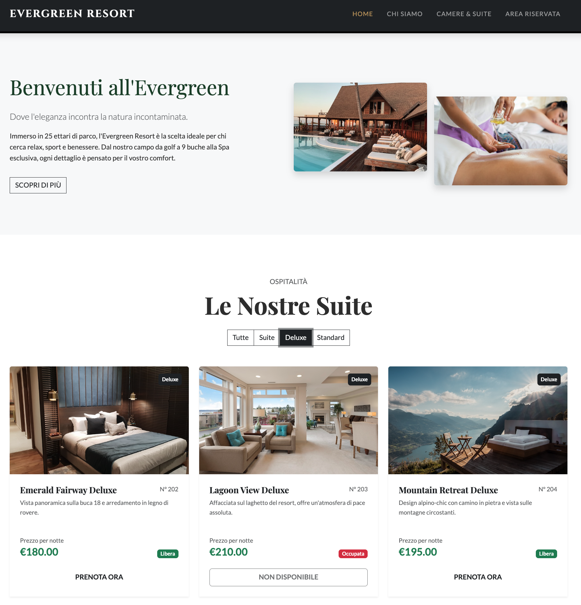
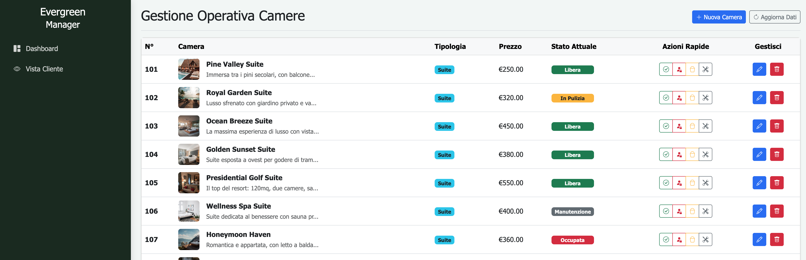

# 🌲 Evergreen Resort - Luxury & Nature

Benvenuto nel repository di **Evergreen Resort**, un sistema completo di gestione alberghiera (PMS) abbinato a un portale web di lusso per i clienti. Questo progetto combina un backend solido in .NET 8 con un frontend elegante e reattivo, offrendo un'esperienza utente premium simile ai migliori resort internazionali.



## 🌟 Caratteristiche Principali

### 🏨 Portale Clienti (Public Facing)
*   **Design Luxury**: Interfaccia curata con font eleganti (Cinzel, Playfair Display), palette colori "Nature & Gold" ed effetti di scorrimento Parallax.
*   **Esperienza Utente**: Navigazione fluida, Hero Section d'impatto e transizioni morbide.
*   **Catalogo Camere**: Visualizzazione dinamica delle camere con filtri per categoria (Suite, Deluxe, Standard).
*   **Prenotazione Smart**: Modal di prenotazione interattivo che simula l'esperienza reale di booking senza ricaricamenti di pagina.
*   **Pagina "Chi Siamo"**: Sezione dedicata allo storytelling del resort, con galleria immagini e valori aziendali.

### ⚙️ Area Amministrativa (Admin Panel)
*   **Gestione Camere (CRUD)**: Pannello di controllo completo per aggiungere, modificare ed eliminare le camere.
*   **Stato in Tempo Reale**: Possibilità di cambiare lo stato delle camere (Libera, Occupata, In Pulizia, Manutenzione) con aggiornamento immediato sul sito pubblico.
*   **Interfaccia Intuitiva**: Dashboard pulita basata su Bootstrap 5.



## 🛠️ Stack Tecnologico

Il progetto è stato sviluppato seguendo i principi della **Clean Architecture** e utilizzando tecnologie moderne e performanti.

### Backend
*   **Framework**: .NET 8 Web API
*   **Linguaggio**: C#
*   **Database**: SQLite (leggero e portabile)
*   **ORM**: Entity Framework Core (Code-First approach)
*   **API**: RESTful endpoints per la gestione dei dati

### Frontend
*   **Struttura**: HTML5 Semantico
*   **Styling**: CSS3 Custom (Variabili CSS, Flexbox/Grid) + Bootstrap 5.3
*   **Logica**: Vanilla JavaScript (ES6+) per interazioni veloci e senza dipendenze pesanti
*   **Font**: Google Fonts (Cinzel, Playfair Display, Lato)
*   **Icone**: FontAwesome

## 📂 Struttura del Progetto

```
EvergreenResort/
├── EvergreenResort.sln          # Soluzione .NET
└── EvergreenResort.Api/         # Progetto Principale
    ├── Controllers/             # API Controllers (es. CamereController.cs)
    ├── Data/                    # Contesto Database (ApplicationDbContext.cs)
    ├── Models/                  # Modelli di Dominio (Camera.cs)
    ├── wwwroot/                 # File Statici (Frontend)
    │   ├── css/                 # Fogli di stile (index.css, admin.css)
    │   ├── js/                  # Logica JavaScript (index.js, admin.js)
    │   ├── index.html           # Home Page Pubblica
    │   ├── about.html           # Pagina Chi Siamo
    │   └── admin.html           # Dashboard Amministrativa
    ├── Evergreen.db             # Database SQLite
    └── Program.cs               # Configurazione e Seed Data
```

## 🚀 Come Iniziare

### Prerequisiti
*   [.NET 8 SDK](https://dotnet.microsoft.com/download/dotnet/8.0) installato sulla macchina.

### Installazione e Avvio

1.  **Clona il repository** (o scarica i file):
    ```bash
    git clone https://github.com/henry8913/evergreen-resort.git
    cd EvergreenResort
    ```

2.  **Ripristina le dipendenze**:
    ```bash
    dotnet restore
    ```

3.  **Avvia l'applicazione**:
    ```bash
    cd EvergreenResort.Api
    dotnet run
    ```

4.  **Accedi al sito**:
    *   Apri il browser e vai su `http://localhost:5000` (o la porta indicata nel terminale).
    *   Per l'area amministrativa: `http://localhost:5000/admin.html`.

## 📸 Anteprima

Il database viene popolato automaticamente all'avvio (`Program.cs`) con un set di dati iniziale che include diverse tipologie di camere (Presidential Golf Suite, Oak Wood Deluxe, ecc.) con immagini di alta qualità pronte all'uso.

## 👤 Autore

Progetto creato da [henry8913](https://github.com/henry8913).

## 📫 Contatti

<div align="center">

[](https://henrygdeveloper.com/)
[](https://linkedin.com/in/henry-k-grecchi-555454254)
[](mailto:henry8913@hotmail.it)
[](https://api.whatsapp.com/send/?phone=393926936916&text&type=phone_number&app_absent=0)

</div>


---

## 📄 Licenza

Questo progetto è rilasciato sotto licenza [GNU GPLv3](LICENSE.txt).
